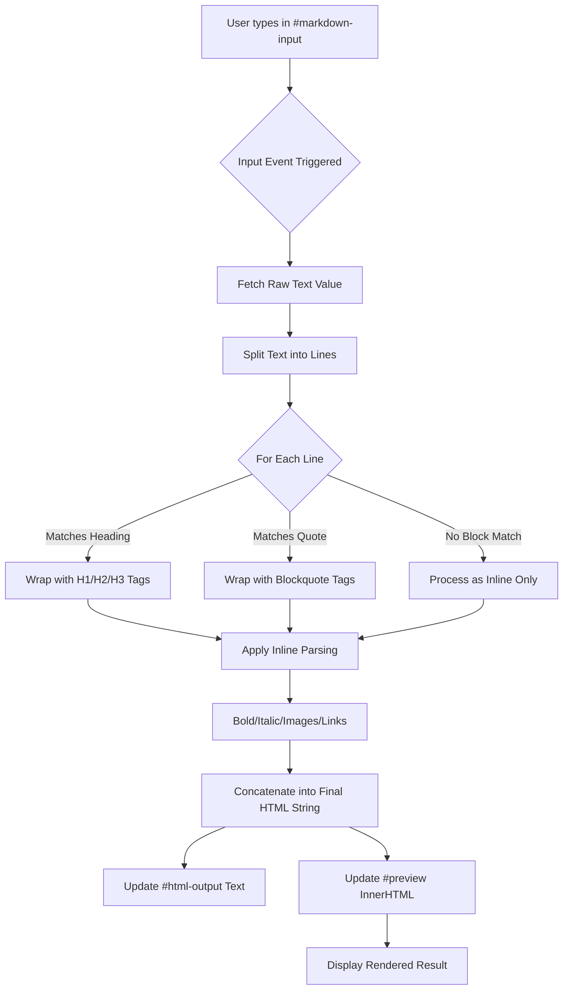

# 📝 Markdown to HTML Converter

A modern, high-fidelity web application that transforms plain-text Markdown into clean, semantic HTML in real-time. Built with a premium "Glassmorphism" aesthetic and optimized for developers and content creators.

---

## 🚀 Introduction
Markdown is the industry standard for writing documentation, blog posts, and readme files. However, viewing the final rendered HTML often requires specialized software or manual conversion. This project provides a **seamless, browser-based solution** that converts Markdown to HTML instantly as you type, featuring a professional UI with live preview and raw code export.

## ❗ The Problem
Standard Markdown editors are often:
- **Clunky and Basic**: Many lack a modern, aesthetic appeal.
- **Disconnected**: Users often have to switch between windows to see the live rendering.
- **Inconsistent**: Some converters fail to handle nested formatting (like bold text inside a title) or leading spaces correctly.
- **Difficult to Integrate**: Developers need a simple, regex-based conversion logic that can be easily understood and modified.

## ✅ The Solution
Our Markdown to HTML Converter addresses these issues by:
1. **Real-time Conversion**: Using the JavaScript `input` event to update the UI instantly (no "Save" or "Convert" buttons required).
2. **Robust Regex Logic**: A custom-built parsing engine that handles:
   - Headings (H1, H2, H3) with leading space support.
   - Bold & Italic (using both `*` and `_` syntax).
   - Images & Hyperlinks.
   - Nested Formatting (e.g., Bold inside a Blockquote).
3. **Premium UI/UX**: A dark-themed, glassmorphic design that prioritizes readability and looks stunning on any device.
4. **Dual Output**: Simultaneously provides the **Raw HTML Code** (for copying into CMS/codebases) and the **Live Visual Preview**.

---

## 📊 Flowchart
The following diagram illustrates the application logic:



---

## 🛠️ Workflow
1. **Entry**: User inputs Markdown syntax into the left panel.
2. **Parsing**: The JavaScript engine processes the input line-by-line using optimized regular expressions.
3. **Rendering**:
   - The **Middle Panel** displays the raw HTML tags for developers.
   - The **Right Panel** renders the HTML visually using a curated CSS design system.
4. **Iterate**: The user refines their content, seeing updates in milliseconds.

---

## 📖 How to Use

1. **Enter Text**: Type any standard Markdown in the **Markdown Input** textarea.
   - Use `#` for headers (e.g., `# This is a Title`).
   - Use `**` or `__` for **bold**.
   - Use `*` or `_` for *italics*.
   - Use `> ` for quotes.
2. **Copy Raw HTML**: Click on the **Raw HTML Output** area to select and copy the generated code for your website.
3. **Check Preview**: Use the **HTML Preview** section to see exactly how your content will look once published.

---

## 📥 Getting Started (from GitHub)

To get a local copy of this project, follow these simple steps:

### Prerequisites
- A modern web browser (Chrome, Firefox, Safari, Edge).
- (Optional) Git installed on your machine.

### Installation
1. **Clone the Repository**:
   ```bash
   git clone https://github.com/your-username/MarkdowntoHTMLConverter.git
   ```
2. **Navigate to the Directory**:
   ```bash
   cd MarkdowntoHTMLConverter
   ```
3. **Open the Project**:
   Double-click the `index.html` file to launch the application in your browser.

---

### Credits
Built with ❤️ by **Antigravity & Voleak**
Providing modern solutions for the web.
